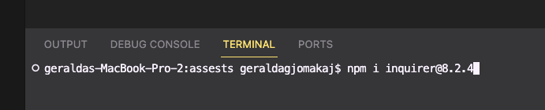

# Readme Generator

## Description

The Readme Generator is a Node.js application that simplifies the process of creating a README file for your projects. It uses the Inquirer package to prompt you for project details and then generates a professional README file based on your input.

## Table of Contents

- [Installation](#installation)
- [Usage](#usage)
- [License](#license)
- [Contributing](#contributing)
- [Tests](#tests)
- [Questions](#questions)
- [Demo](#demo)

## Installation

1. Make sure you have Node.js installed on your computer.
2. Clone this repository: `git clone https://github.com/yourusername/readme-generator.git`.
3. Navigate to the project directory: `cd readme-generator`.
4. Install the required npm packages: `npm install`.

## Usage

1. Run the application: `node index.js`.
2. Answer the prompts to provide project details.
3. A README file will be generated based on your input.

[video of usage](https://drive.google.com/file/d/1kuRzwPZwyn3WdwTlgJd5uqSQq0wOhcqx/view?usp=drive_link)

## License

    This project is licensed under the [MIT License]([License](https://opensource.org/licenses/MIT)).

## Contributing

Contributions are welcome!

## Tests

To ensure that this project functions as expected and to validate its integrity, follow these steps to run the tests:

To test the application, run the following command:

npm test

## Questions

If you have any questions or need further assistance, don't hesitate to reach out. You can contact me through one of the following methods:

GitHub: https://github.com/GiGeej

For further questions, contact me via email: Gigeej009@gmail.com
